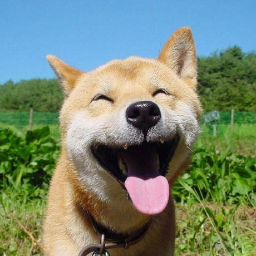

### Deep Image Prior

#### Overview
This directory contains Keras reimplementation of [Deep Image Prior](https://dmitryulyanov.github.io/deep_image_prior).

#### Notes
* The noisy observation is obtained by adding a certain amount of random noise to the clean image.
* The input is a random code vector and the output is the noisy observation. The neural network is optimized by minimizing the mean squared error.
* The parametrization offers high impedance to noise and low impedance to signal. Before the model starts to overfit, it recovers most of the signal while discarding the noise. The noise in the predicted image is suppressed significantly.

|  |  |  |
|:---:|:---:|:---:|
| clean image | noisy observation | prediction |
