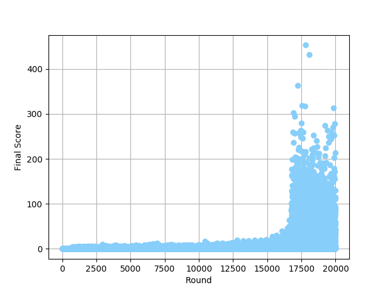

### Flappy Bird

#### Overview
This directory contains Python implementation which is capable of playing [Flappy Bird](https://en.wikipedia.org/wiki/Flappy_Bird) using Reinforcement Learning.

#### Notes
* The agent only sees the raw pixel values and the rewards. It is trained from scratch without human supervision.
* After 20000 rounds, the bird could fly over 400 columns without crashing.

* [Sourabh Verma](https://github.com/sourabhv/FlapPyBird) ported this notorious game to Python and [Yen-Chen Lin](https://github.com/yenchenlin/DeepLearningFlappyBird) implemented a Reinforcement Learning based algorithm to play Flappy Bird.
